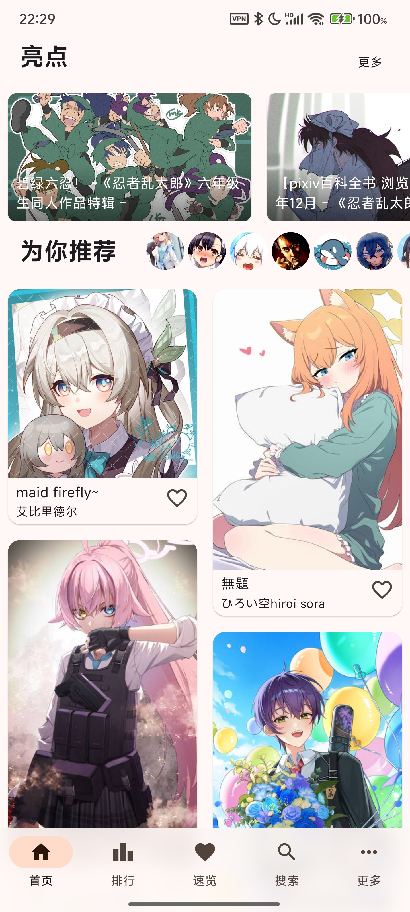
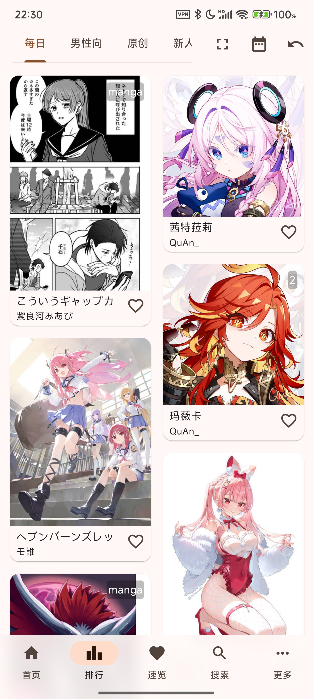

# PixEz Flutter 

A 3rd-party pixiv client built with Flutter.

Can access pixiv directly from Mainland China.

# Download

|OS|Source|
|:---:|:---:|
|Android|[Google play](https://play.google.com/store/apps/details?id=com.perol.play.pixez) \| [GitHub Release](https://github.com/Notsfsssf/pixez-flutter/releases)|
|iOS|[App Store](https://apps.apple.com/cn/app/pixez/id1494435126)|

# Preview

| |  | 
|:-------------------:|:------------------------:|

# Contribute

As you see, Flutter is a framework that helps developer to design UI fastly.

Its Hot Reload feature can shorten debug time greatly, making the process WYSIWYG.

By using PlatformChannel, you can create specific functionalities for different platforms.

This app uses `mobx`, `flutter_bloc` (will be deprecated), `provider` to manage status, and `custompainter` to play ugoira.

***

If you are a developer, and you're willing to contribute to this project, please don't hesitate to submit a PR!

This app also uses `flutter_intl` to localize. You're welcome to commit translation too.

(zh_TW by @TragicLifeHu, en_US by @XIAN)

Got ideas about UI design? You're also welcome to share your opinions.

# Communicate

We have a [manual and FAQ page here (Chinese only)](./FAQ.md).

Mail Feedback: PxezFeedback@outlook.com

Also, feedback on Telegram: [@PixEzViewer](https://t.me/PixEzViewer)

(Mainly Chinese, English welcomed)

If you have questions about registering or 🔞, please don't ask for a solution, though.