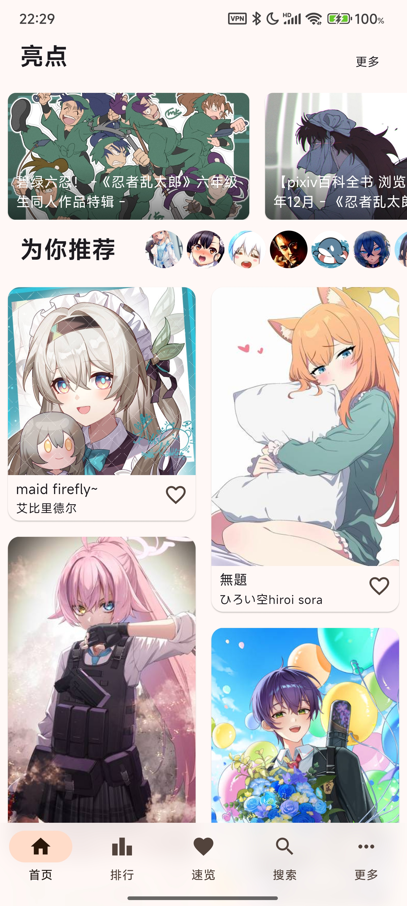
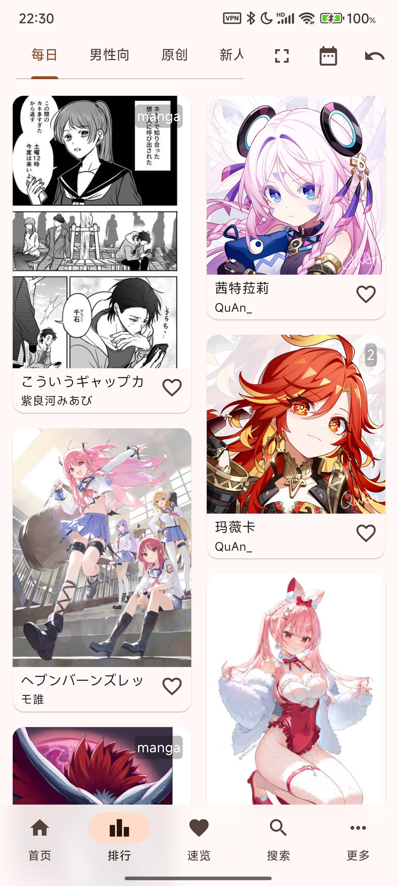

# PixEz Flutter 

[English README Here](./.github/README_en.md) 
[README Bahasa Indonesia klik disini](./.github/README_id.md)

使用 Flutter 编写的 pixiv 第三方客户端。

同样支持中国大陆地区直连。

🎵 Mili - In Hell We Live, Lament 🎵 

# 下载

推荐渠道顺序为从左到右。

|系统|应用市场|GitHub|云盘|
|:---:|:---:|:---:|:---:|
|Android|[Google Play](https://play.google.com/store/apps/details?id=com.perol.play.pixez)|[Release](https://github.com/Notsfsssf/pixez-flutter/releases)|[蓝奏云](https://wwa.lanzoui.com/b0ded45id) **临时，不推荐**|
|iOS|[App Store(美区)](https://apps.apple.com/us/app/pixez/id1494435126)|[Action Ipa](https://github.com/Notsfsssf/pixez-flutter/actions/workflows/main.yml)|/|

# 预览

| |  | 
|:-------------------:|:------------------------:|

# 关于项目 / About Repository

如你所见，Flutter 是一个能够帮助开发者快速开发界面的框架。

拥有的 Hot Reload 热重载，可以极大缩减 debug 成本，所见即所得，快速交流；

利用 PlatformChannel，可以为不同平台编写不同的平台特性的独有功能；

应用使用了 `mobx`，`flutter_bloc` (逐步弃用)，`provider` 进行状态管理，`custompainter` 来播放 ugoira。

## 贡献 / Contribute

本项目目前的贡献者列表如下：

<table>
  <tr>
    <td align="center"><a href="https://github.com/Notsfsssf"> <b>Perol_Notsfsssf</b></a> <a href="https://github.com/Skimige/pixez-flutter/commits?author=Notsfsssf" title="Code">💻</a></td>
    <td align="center"><a href="https://xyx.moe"> <b>Skimige</b></a> <a href="https://github.com/Skimige/pixez-flutter/commits?author=Skimige" title="Documentation">📖</a></td>
    <td align="center"><a href="https://github.com/TragicLifeHu"> <b>Tragic Life</b></a> <a href="#translation-TragicLifeHu" title="Translation">🌍 (zh_TW)</a></td>
    <td align="center"><a href="http://ivtune.net"> <b>karin722</b></a> <a href="#translation-karin722" title="Translation">🌍 (ja)</a></td>
    <td align="center"><a href="http://archman.fun"> <b>Romani-Archman</b></a> <a href="https://github.com/Skimige/pixez-flutter/commits?author=Romani-Archman" title="Documentation">📖</a></td>
    <td align="center"><a href="https://github.com/itzXian"> <b>Xian</b></a> <a href="#translation-itzXian" title="Translation">🌍 (en_US)</a></td>
    <td align="center"><a href="https://github.com/ReikiAigawara"> <b>Reiki Aigawara</b></a> <a href="#translation-ReikiAigawara" title="Translation">🌍 (id_ID)</a></td>
  </tr>
</table>

如果你是有能人士，愿意为本项目贡献代码，请不要犹豫提交 Pull Request 吧！

本应用也使用了 `intl` 进行国际化，欢迎贡献[翻译](lib/l10n/intl_en_US.arb)！

觉得有些地方设计的不妥？同样欢迎分享设计。

## 常见问题及交流反馈

[使用指南 & 常见问题在这里](.github/FAQ.md)，反馈问题 / 加群询问之前请先看！（特别是旧原生版用户）

邮件反馈：PxezFeedback@outlook.com

也可以在 Telegram 群交流反馈：[@PixEzViewer](https://t.me/PixEzChannel)

Discord: [@PixEz](https://discord.gg/Em9AeJbg)

也可以进企鹅群交流经验或者反馈：815791942（闲聊为主）
